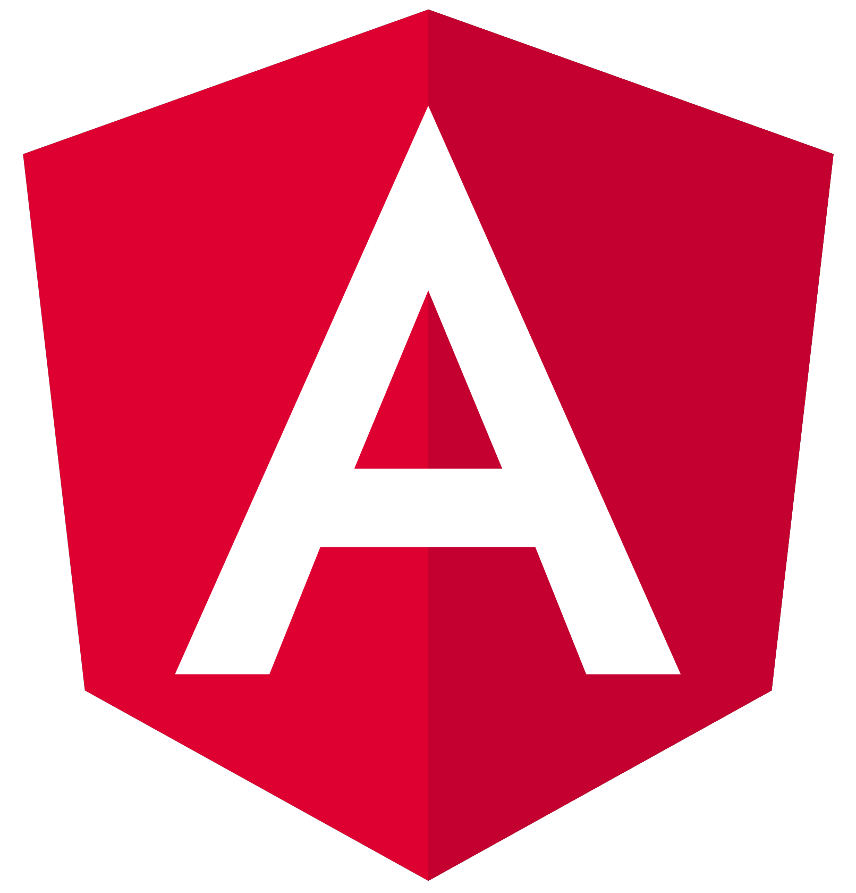

# Guru - Interviews Coach

`Guru` is your virtual interview coach, meticulously crafted to guide you through the intricacies of interview preparation. With `Guru`, access a wealth of resources, from expert tips to comprehensive guidance, all aimed at sharpening your interview skills.

Engage in lifelike mock interviews, receive valuable feedback, and track your progress effortlessly. Let `Guru` be your trusted companion in navigating the competitive landscape of interviews, ensuring you're poised and ready for your career aspirations.

> Good luck!

**Technologies used**

<a href="https://angular.dev/" title="Angular"></a>
<a href="https://learn.microsoft.com/en-us/training/modules/typescript-get-started/" title="TypeScript"></a>
<a href="https://platform.openai.com/" title="ChatGPT"></a>
<a href="https://www.w3schools.com/html/" title="HTML"></a>
<a href="https://www.w3schools.com/css/" title="CSS"></a>
<a href="https://www.postman.com/" title="Postman"></a>
<a href="https://git-scm.com/" title="Git"></a>


**Installation**

1. Clone this repository 
```js
git clone https://github.com/luisvillarrealx/Guru.git
```
2. Run npm install to install dependencies.
```js
npm i
```
3. Add your API key in the file `prompt.service.ts`

```js
private apiKey = 'YOUR_API_KEY';
```

3. Use ng serve to start the development server.
```js
ng serve --open
```
or simply
```js
ng s -o
```
4. Wait for the project to build and run at http://localhost:4200.
